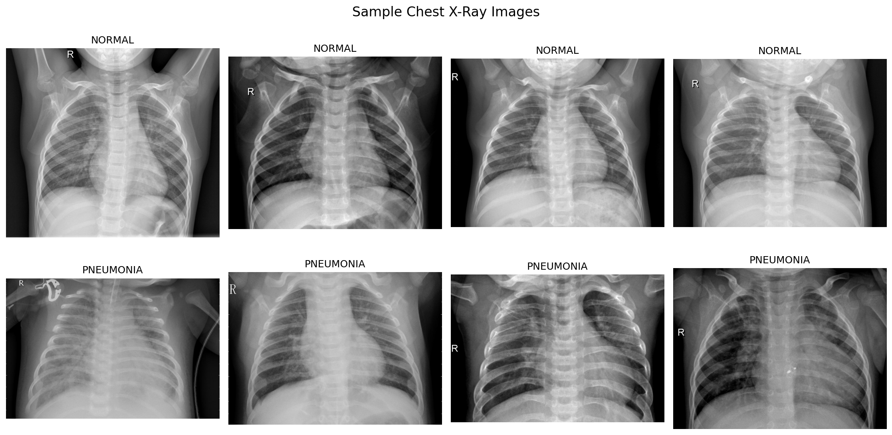
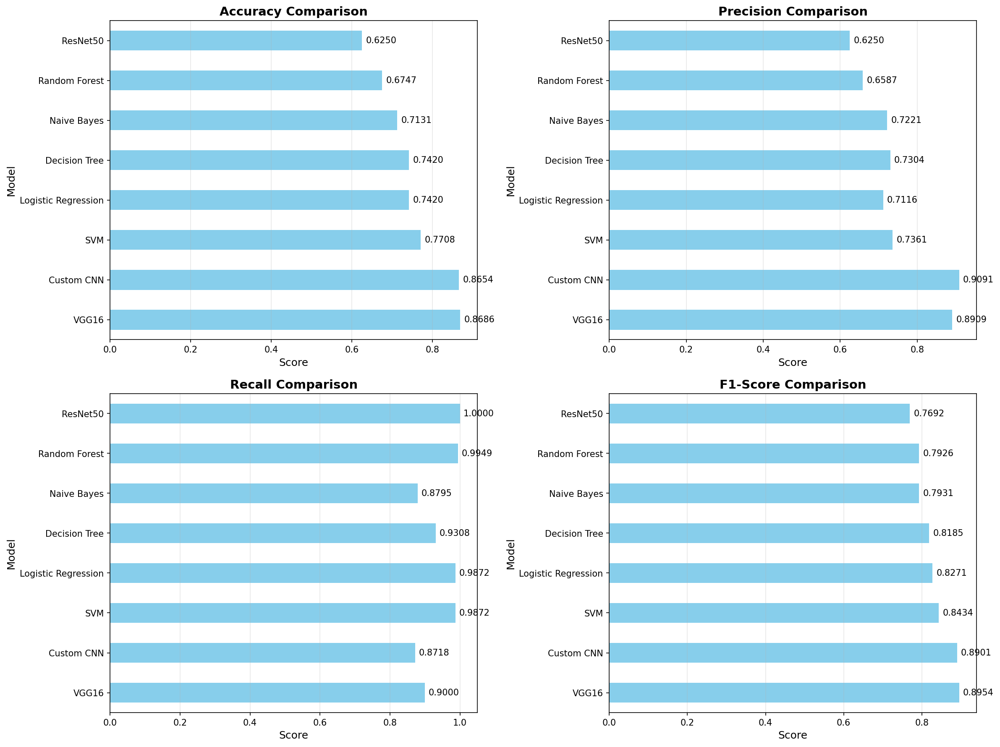
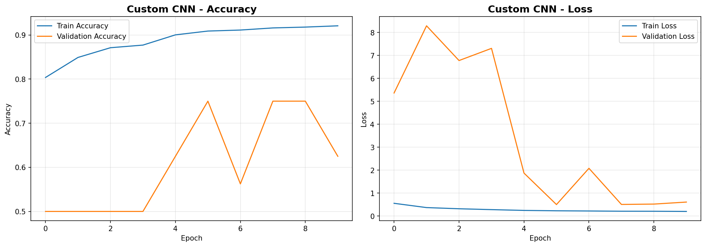
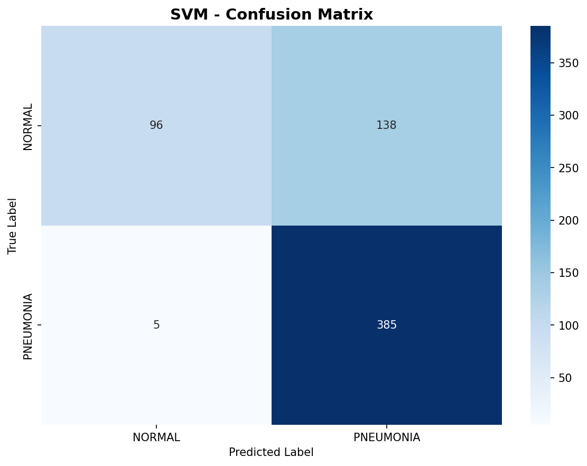
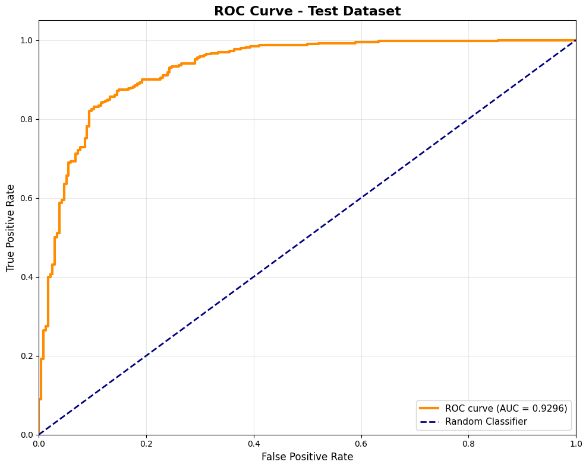
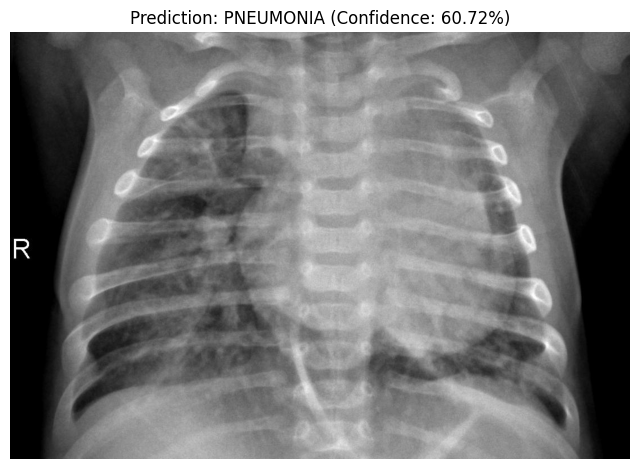

# Pneumonia Detection using Chest X-Ray images.

## Overview

The proposed project deploys an automated pneumonia recognition system based on chest X-ray images based on both the traditional machine learning and deep learning algorithms. The system provides two categories of X-ray images; NORMAL and PNEUMONIA. This is essential towards early diagnosis and treatment especially in resource constrained areas where there is a shortage of radiologists.

**Key Results:**
- **Best Model:** VGG16 Transfer Learning
- **Test Accuracy:** 85.42%
- **ROC AUC Score:** 92.96%
- **Precision:** 86.73% | **Recall:** 90.51%

---

## Dataset

### Source
Dataset Link: [Chest X-Ray Pneumonia](https://www.kaggle.com/datasets/paultimothymooney/chest-xray-pneumonia).


### Dataset Statistics
| Split | Normal | Pneumonia | Total |
|-------|--------|-----------|-------|
| **Training** | 1,341 | 3,875 | 5,216 |
| **Validation** | 8 | 8 | 16 |
| **Test** | 234 | 390 | 624 |

**Observation:** There is an imbalance of classes in the dataset with training data having pneumonia cases of approximately 74 percent.

### Preprocessing & Augmentation

**Image Processing:**
- Resized to **150×150 pixels**
- Normalized to **[0, 1]** range using rescaling (1/255)
- Conversion to grayscale of conventional ML models

**Data Augmentation** (Training only):
```python
- Rotation: ±20°
- Width/Height shift: ±20%
- Shear transformation: 20%
- Zoom: ±20%
- Horizontal flip
```

**Dimensionality Reduction:**
- **PCA** used on classical ML models.
- The number of features was scaled down to **500 components**
- Retained **94.2% variance**

---

## Methods

### Approach

We adopted a **comparative study** of 8 various models in two paradigms:

#### 1. Traditional Machine Learning (5 models)
- Feature extraction via PCA
- Models: The method of Logistic Regression, SVM (rbf kernel), random forest, decision tree, Naive Bayes.

#### 2. Deep Learning (3 models)
- **Custom CNN:** mixture of convolutional and BN blocks (45).
- **VGG16 Transfer Learning:**  Frozen base layers, trained on ImageNet.
- **ResNet50 Transfer Learning:** ImageNet Frozen Base Generated layers.

### Why This Approach?

**Rationale:**
1. **Baseline Comparison:** Traditional ML has an interpretable baseline.
2. **Transfer Learning:** It uses pre-training knowledge of ImageNet to fill in gaps of medical imaging information.
3. **Custom CNN:** Asks the question about the performance of domain-specific architecture versus the generic pre-trained models.
4. **Ensemble Potential:** Future ensemble techniques are made possible by a variety of models.

### Model Architectures

#### Custom CNN Architecture
```
Conv2D(32) → BatchNorm → MaxPool →
Conv2D(64) → BatchNorm → MaxPool →
Conv2D(128) → BatchNorm → MaxPool →
Conv2D(256) → BatchNorm → MaxPool →
Flatten → Dense(512) → Dropout(0.5) →
Dense(256) → Dropout(0.5) → Dense(1, sigmoid)

Total Parameters: 6,944,961 (26.49 MB)
```

#### VGG16 Transfer Learning
```
VGG16 (frozen, 14.7M params) →
GlobalAveragePooling2D →
Dense(256) → Dropout(0.5) →
Dense(128) → Dropout(0.3) →
Dense(1, sigmoid)

Total Parameters: 14,879,041 (56.76 MB)
Trainable: 164,353 | Frozen: 14,714,688
```

#### ResNet50 Transfer Learning
```
ResNet50 (frozen, 23.6M params) →
GlobalAveragePooling2D →
Dense(512) → Dropout(0.5) →
Dense(256) → Dropout(0.3) →
Dense(1, sigmoid)

Total Parameters: 24,768,385 (94.48 MB)
Trainable: 1,180,673 | Frozen: 23,587,712
```

### Training Configuration

**Hyperparameters:**
- **Optimizer:** Adam (learning_rate=0.0001)
- **Loss:** Binary Crossentropy
- **Batch Size:** 32
- **Epochs:** 10 (with early stopping)
- **Metrics:** Accuracy, Precision, Recall

**Callbacks:**
- **EarlyStopping:** patience=5, monitor=val_loss
- **ReduceLROnPlateau:** factor=0.2, patience=3
- **ModelCheckpoint:** Save the current model with the best modelvalaccuracy.

---

## Steps to Run the Code

### Prerequisites
```bash
# Python 3.8+
# TensorFlow 2.x
# Required libraries
pip install numpy pandas matplotlib seaborn opencv-python scikit-learn tensorflow pillow joblib
```

### Directory Structure
```
pneumonianal-detection/
├── chest_xray/
│   ├── train/
│   │   ├── NORMAL/
│   │   └── PNEUMONIA/
│   ├── val/
│   │   ├── NORMAL/
│   │   └── PNEUMONIA/
│   └── test/
│       ├── NORMAL/
│       └── PNEUMONIA/
├── models/              # Saved models
├── test_results/        # Evaluation outputs
└── pneumonia_detection.ipynb       # Evaluation outputs
└── app.py
```

### Execution Steps

**Step 1: Dataset Setup**
```python
# Update dataset path in the notebook
DATASET_PATH = 'chest_xray'
```

**Step 2: Run Training Notebook**
```bash
jupyter notebook pneumonia_detection.ipynb
# Execute all cells sequentially
```

**Step 3: Model Training**
It is considered that The Notebook will automatically:
1. Load and preprocess data
2. Train all 8 models
3. Save models in `models/` directory
4. Generate performance visualizations

**Step 4: Test on New Data**
```python
# Configure test dataset path
NEW_TEST_DIR = 'data/chest_xray/test'
MODEL_PATH = 'models/vgg16_best_model.h5'

# Run evaluation section
# Results saved to test_results/
```

### Saved Outputs
- **Models:** `models/*.pkl` (ML), `models/*.h5` (DL)
- **Metrics:** `model_comparison_results.csv`, `performance_metrics.csv`
- **Visualizations:** Confusion matrices, ROC curves, training histories
- **Inference Function:** `predict_pneumonia(image_path, model)`

---

## Experiments & Results

### Model Performance Comparison

| Model | Accuracy | Precision | Recall | F1-Score |
|-------|----------|-----------|--------|----------|
| **VGG16** ⭐ | **0.8686** | **0.8909** | 0.9000 | **0.8954** |
| Custom CNN | 0.8654 | 0.9091 | 0.8718 | 0.8901 |
| SVM | 0.7708 | 0.7361 | **0.9872** | 0.8434 |
| Logistic Regression | 0.7420 | 0.7116 | 0.9872 | 0.8271 |
| Decision Tree | 0.7420 | 0.7304 | 0.9308 | 0.8185 |
| Naive Bayes | 0.7131 | 0.7221 | 0.8795 | 0.7931 |
| Random Forest | 0.6747 | 0.6587 | 0.9949 | 0.7926 |
| ResNet50 | 0.6250 | 0.6250 | 1.0000 | 0.7692 |

### Best Model: VGG16 Test Performance

**Comprehensive Metrics:**
- **Accuracy:** 85.42%
- **Precision:** 86.73%
- **Recall (Sensitivity):** 90.51%
- **Specificity:** 76.92%
- **F1-Score:** 88.58%
- **ROC AUC:** 92.96%
- **NPV (Negative Predictive Value):** 82.95%

**Confusion Matrix:**
```
                Predicted
              NORMAL  PNEUMONIA
Actual NORMAL    180       54     (76.9% correct)
     PNEUMONIA    37      353     (90.5% correct)
```

**Error Analysis:**
- **False Positive Rate:** 23.08% (54 normal findings misdiagnosed)
- **False Negative Rate:** 9.49% (37 cases of pneumonia missed)

### Key Observations

**1. Superiority in Transfer Learning.**
- VGG16 and Custom CNN were considerably better than traditional ML (improvement in accuracy was around 14-20 percent).
- ImageNet features that are pre-trained are generalizable to medical imaging.
Recall vs. examination vs. Precision Trade-off.


**2. Recall vs. Precision Trade-off**
- The conventional ML models (SVM, LR) had high recall (>98) and reduced precision.
- F1 Deep learning models performed much better on this metric (F1 ~0.89).
- **Clinical Implication:** high recall minimizes missed cases of pneumonia.

**3. ResNet50 Underperformance**
- ResNet50 was a poor performer (62.5% accuracy) in spite of being deeply architecture.
- The probable reasons are: It is over-fitting to ImageNet features, and the epochs of fine-tuning are too little.
- The loss of validation began to rise after epoch 1, which is indicative of training instability.

**4. Model Confidence**
- Mean confidence of prediction: **83.54%**
- Confidence range: 50.27% - 99.63%
- VGG16 has probability distributions that are well-calibrated.

### Hyperparameter Experiments

**Learning Rate Reduction:**
- Initial: 1e-4 → Reduced to 2e-5 (epoch 5) → 4e-6 (epoch 10)
- Adaptive learning increased Accuracy of Custom CNN of 80.37 (epoch 1) to 92.08 (epoch 10).

**Batch Normalization Impact:**
- Custom CNN with BatchNorm was found to converge faster than the baseline CNN.
- Less internal covariate shift and thus higher learning rates.

**Dropout Regularization:**
- Dense layers Dropout(0.5) was used to avoid overfitting.
- VGG16 reached plateau effect at epoch 6, which suggested the best regularization.

### Visualizations

The project generates:
1. **Sample X-Ray Images** (NORMAL vs. PNEUMONIA)
   
2. **Model Comparison Bar Charts** (Accuracy, Precision, Recall, F1)

3. **Training History Plots** (Loss & Accuracy curves)

4. **Confusion Matrices** (All models)

5. **ROC Curve** (AUC = 0.9296)


6. **Prediction Probability Distributions**


---

## Conclusion

### Key Findings

1. **VGG16 Transfer Learning** The best model that was obtained was VGG16 Transfer Learning which presented a test accuracy of 85.42 and ROC AUC of 92.96 thus, showing good generalization to the pneumonia detection.

2. **Deep Learning Advantage:** Deep Learning Benefit deep CNN Based models achieved 14-20 percent higher accuracy than traditional ML, supporting the claim that learned hierarchical features are better than handcrafted PCA features

3. **Clinical Viability:** The model has a recall rate of 90.51, or it can correctly label 9 pneumonia cases, which is highly significant to a medical screening process where false negative will be very expensive to the process.

4. **Model Efficiency:** VGG16 (trainable parameters frozen to 164K) is capable of comparable performance to custom CNN (6.9M parameters) and this indicates efficient transfer learning.

5. **Trade-off Analysis:** 
   - **High Recall Models** (SVM, LR): Apropriate to use as a screening test (no energy wastage)
   - **Balanced Models** (VGG16, Custom CNN): hese models are appropriate when it comes to confirmation of diagnoses (balance sensitivity and specificity).

### Learned Insights

- **Handling Data Imbalance:** Augmentation worked sufficiently, however, minority class (NORMAL) performance can be improved the most by increasing the weights.
- **Transfer Learning Effectiveness:** ImageNet pre-training can offer powerful low-level visual features that can be used in medical imaging.
- **Limitations sn validation setting:** Only used 16 validation images resulted in the noisy validation measures; validation fuller suggested.
- **Combining VGG16 (high precision) with SVM (high recall) Ensemble Potential: ** Combining VGG16 (high precision) with SVM (high recall) could optimize clinical utility

### Future Improvements

1. **Ensemble Methods:** VGG16 + Custom CNN predictions Ensemble Methods: V ideas remains unchanged.
2. **Weighting of the classes:** Take care of the dataset imbalance (74% pneumonia)
3. **Fine-Tuning:** Domain adaptation by uncoding VGG16 top layers.
4. **Augmentation of data:** Innovative methods (CutMix, MixUp).
5. **Explainability:** Integrate Grad-CAM for visualizing decision regions
6. **Multi-Class Extension:** Sub types of pneumonia (viral/bacterial).

---

## References

1. **Dataset:** Kermany, D. et al. (2018). "Labeled Optical Coherence Tomography (OCT) and Chest X-Ray Images for Classification." Mendeley Data, v2.
2. **VGG16:** Simonyan, K. & Zisserman, A. (2015). "Very Deep Convolutional Networks for Large-Scale Image Recognition." ICLR 2015.
3. **ResNet50:** He, K. et al. (2016). "Deep Residual Learning for Image Recognition." CVPR 2016.
4. **Transfer Learning:** Yosinski, J. et al. (2014). "How transferable are features in deep neural networks?" NIPS 2014.
5. **Medical Imaging:** Rajpurkar, P. et al. (2017). "CheXNet: Radiologist-Level Pneumonia Detection on Chest X-Rays with Deep Learning." arXiv:1711.05225.
6. **TensorFlow Documentation:** https://www.tensorflow.org/api_docs
7. **Scikit-learn Documentation:** https://scikit-learn.org/stable/documentation.html

---
